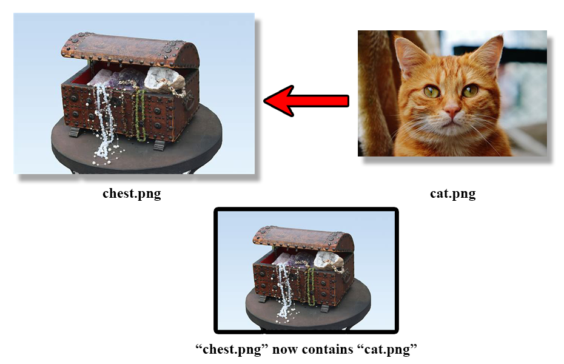
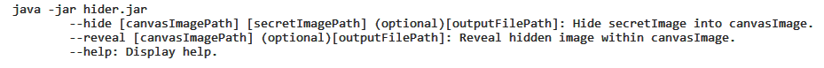

# ImageHider
Steganography script to hide images within images.

## Base concept
Steganography can be defined as "the practice of concealing a message within another message". As such, this tool is designed to conceal an image file (the *secret image*) within another image file that will serve as the *canvas image*.

Of course, this process can also be applied in reverse, to retrieve said hidden image from the tampered canvas.

## Using the tool
This is exclusively a command line tool, fully written in pure Java. It's also designed to be lossless when dealing with *secret image* information (apart from opacity/alpha data), and so can be used in succession to hide pictures within pictures, within pictures.
This project admits the following parameters on launch:

## Video showcase

https://user-images.githubusercontent.com/43352462/218427508-7cc19d21-df00-49c8-8890-1c63d86e7e7f.mp4
