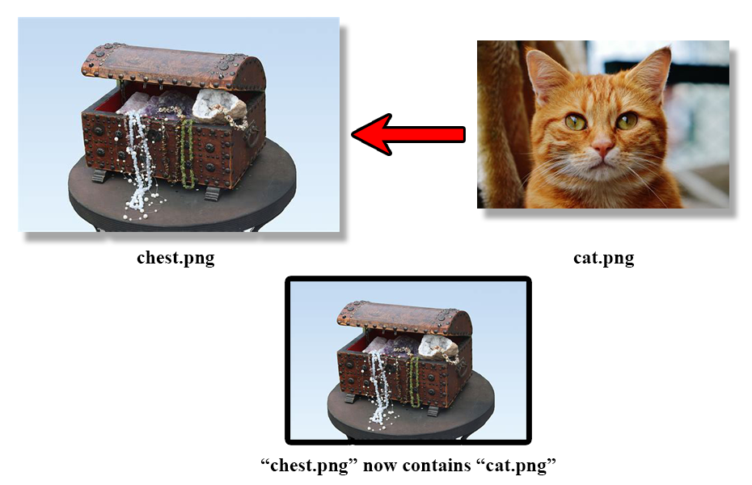

# ImageHider
Steganography script to hide images within images.

## Base concept
Steganography can be defined as "the practice of concealing a message within another message". As such, this tool is designed to conceal an image file (the *secret image*) within another image file that will serve as the *canvas image*.

## Using the tool
This is exclusively a command line tool, fully written in pure Java. It's also designed to be lossless when dealing with *secret image* information (apart from opacity/alpha data), and so can be used in succession to hide pictures within pictures, within pictures.
This project admits the following parameters on launch:

`java -jar hider.jar`
	`--hide [canvasImagePath] [secretImagePath] (optional)[outputFilePath]:	Hide secretImage into canvasImage.`
	`--reveal [canvasImage] (optional)[outputFilePath]:						Reveal hidden image within canvasImage.`
	`--help:																Display help.`